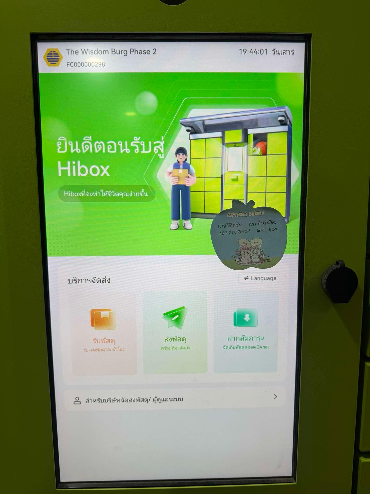

# **🔒 Security Control: ตู้ HIBOX**

**📍 สถานที่:** คอนโด  
**🛡️ Control Function:** Preventative  
**🏢 Type of Security Control:** Physical Control  

---

---

## **📝 ขั้นตอนการทำงานของตู้ HIBOX**

### 1️⃣ การรับ SMS ยืนยัน  
📩 ก่อนที่เราจะสามารถลงมารับพัสดุได้ **เราจะต้องได้รับ SMS ยืนยัน** ดังตัวอย่างด้านล่าง:  
> SMS จะส่งมาหลังจากที่พนักงานส่งพัสดุได้นำพัสดุของเรามาใส่ไว้ในตู้ Hibox แล้ว  

📌 เมื่อได้รับข้อความยืนยันแล้ว สามารถลงมาที่กล่อง Hibox ได้เลย 🚶‍♂️🚶‍♀️  

---

### 2️⃣ การใช้รหัส SMS  
🔢 นำรหัสที่ได้รับจาก SMS มากรอกในหน้าจอของตู้ Hibox  
✅ เมื่อกรอกรหัสเสร็จ **ตู้จะเปิดอัตโนมัติทันที** 🚪✨  

---

### 3️⃣ การรับพัสดุ  
📦 เมื่อประตูตู้เปิดออกแล้ว สามารถ **หยิบพัสดุของคุณออกมา** ได้เลย  
⚠️ **อย่าลืมปิดตู้** หลังหยิบพัสดุเสร็จ เพื่อให้ผู้ใช้รายถัดไปสามารถใช้งานได้ 🙏  

---

## **💡 ทำไมตู้ HIBOX ถึงเป็น Physical และ Preventative Control?**

### 🔑 **Physical Control**  
- ตู้ HIBOX เป็นตัวควบคุมความปลอดภัยแบบ **Physical Control** เนื่องจากเป็น **อุปกรณ์จับต้องได้** ที่ใช้กลไกทางกายภาพ เช่น กล่องจัดเก็บพัสดุที่ล็อกได้  
- ใช้ **รหัสผ่าน (PIN Code)** ในการเข้าถึงเพื่อป้องกันการเข้าถึงโดยไม่ได้รับอนุญาต  
- ช่วยจัดเก็บพัสดุในพื้นที่ที่ปลอดภัย ซึ่งช่วยลดความเสี่ยงของการสูญหายหรือการถูกขโมย  

### 🛡️ **Preventative Control**  
- ตู้ HIBOX ทำหน้าที่เป็น **Preventative Control** เพราะช่วยป้องกัน **ปัญหาที่อาจเกิดขึ้นล่วงหน้า** เช่น:  
  1. การสูญหายของพัสดุ (Loss Prevention)  
  2. การเข้าถึงพัสดุโดยผู้ที่ไม่ได้รับอนุญาต (Unauthorized Access Prevention)  
- การใช้ PIN Code และระบบ SMS ยืนยัน ทำให้ผู้ใช้มั่นใจได้ว่าเฉพาะเจ้าของพัสดุเท่านั้นที่จะสามารถเข้าถึงพัสดุได้  

---

> **💡 หมายเหตุ:**  
ตู้ HIBOX เป็นระบบ Physical Security Control ที่ช่วยป้องกันความเสี่ยงและเสริมความปลอดภัยในการจัดการพัสดุ ✨🔐  
