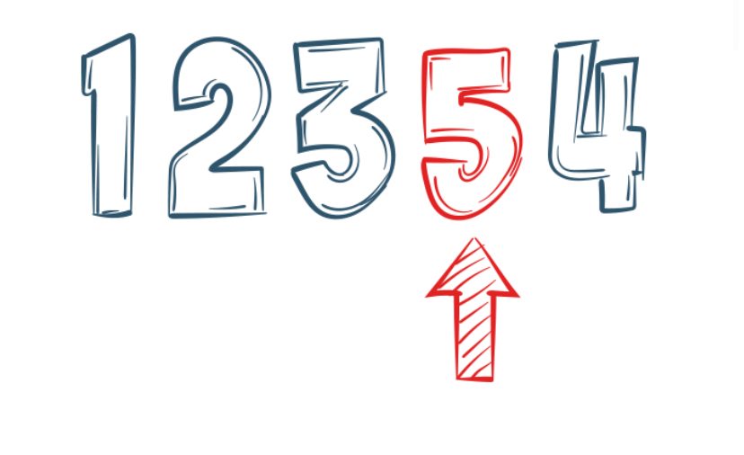

<h1>**VALIDITY**</h1>
  

**Defination by [iceDQ](https://icedq.com/6-data-quality-dimensions#validity)**

- Validity: Data validity describes the closeness of data value to predetermined values or a calculation.

**Chat GPT**

- ความถูกต้องของข้อมูล(Validity): ความใกล้เคียงของค่าข้อมูลกับค่าที่กำหนดล่วงหน้าหรือการคำนวณ

**Gimini**

- ความถูกต้องของข้อมูล อธิบายถึงความใกล้เคียงของค่าข้อมูลกับค่าที่กำหนดไว้ล่วงหน้าหรือการคำนวณ

**My summary**

- Validity หมายถึง ความถูกต้อง หรือ ความเที่ยงตรง ของข้อมูล นั่นคือ ข้อมูลนั้นต้องสอดคล้องกับความเป็นจริง หรือค่าที่กำหนดไว้ล่วงหน้า และสามารถนำไปใช้ในการวิเคราะห์ หรือตัดสินใจได้อย่างถูกต้อง

**Sample**

- Data Validity based Sequence of events(Invalid Sequence)
  
 

- โดยปกติแล้ว คุณไม่สามารถจัดส่งสินค้าได้หากยังไม่มีการสั่งซื้อสินค้า ซึ่งเป็นกฎทางธุรกิจ ดังนั้น หากพบข้อมูลการจัดส่งที่มีวันที่จัดส่งน้อยกว่าวันที่สั่งซื้อสินค้า แสดงว่ามีปัญหาเกี่ยวกับการตรวจสอบความถูกต้องของข้อมูล
